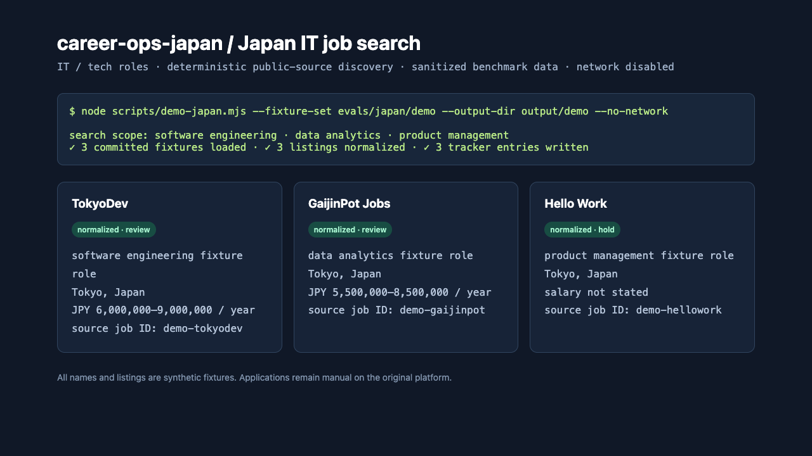
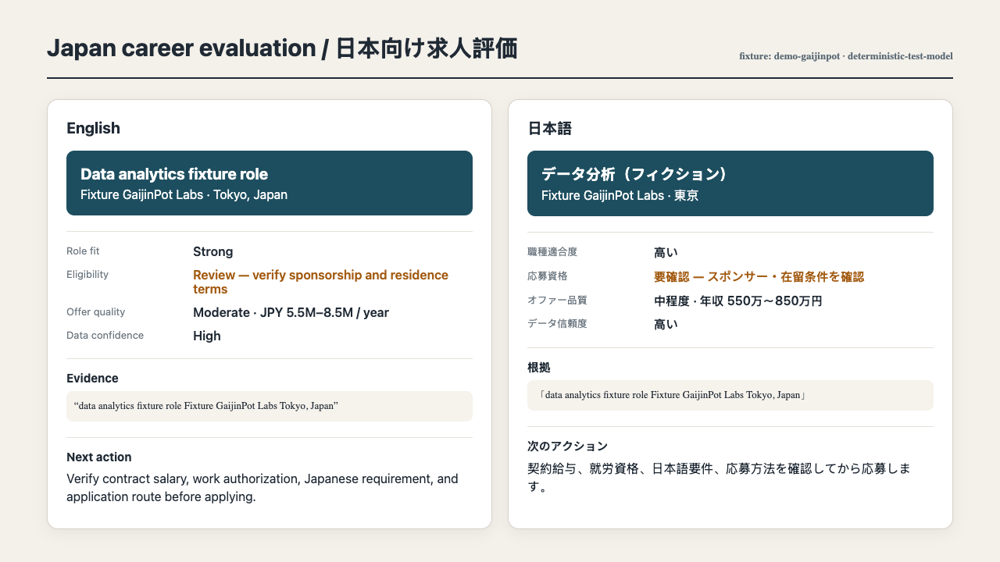
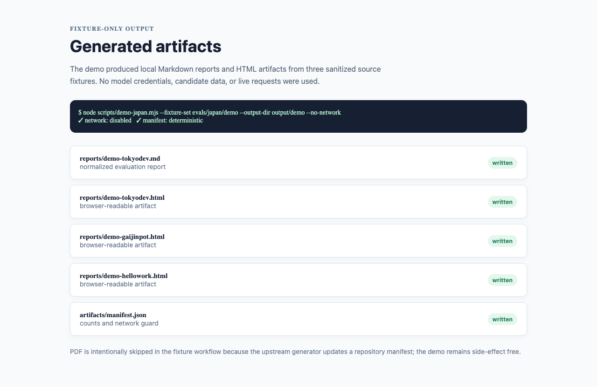
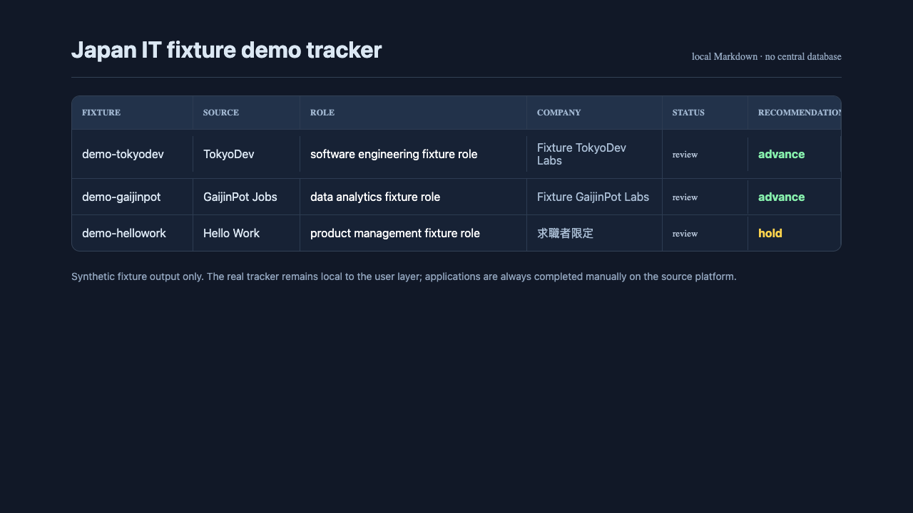

<p align="center"><picture><source media="(prefers-color-scheme: dark)" srcset="docs/wordmark-dark.svg"></picture></p>

<div align="center">

[English](README.md) | [Español](README.es.md) | [Deutsch](README.de.md) | [Français](README.fr.md) | [Português (Brasil)](README.pt-BR.md) | [한국어](README.ko-KR.md) | [日本語](README.ja.md) | [简体中文](README.cn.md) | [繁體中文](README.zh-TW.md) | [Українська](README.ua.md) | [Русский](README.ru.md) | [Polski](README.pl.md) | [Dansk](README.da.md) | [العربية](README.ar.md) | [हिन्दी](README.hi.md)

</div>

# career-ops-japan

> Based on [santifer/career-ops](https://github.com/santifer/career-ops).

このリポジトリは日本向けの vertical slice です。公開するワークフローは
ローカル実行・CLI 専用で、Node.js スクリプトと選択した AI コーディング CLI を使います。
npm パッケージ、単独のモデル API、Web UI をこのリポジトリの機能として公開・保証するものではありません。

<p align="center">
  <a href="https://x.com/santifer"></a>
</p>

<p align="center">
  <strong>日本向け求人を扱う、ローカルで動く fixture ベースの CLI ワークフロー。</strong><br>
  公開求人を評価し、不明点を保持し、確認用の成果物を作成します。
</p>

---

<p align="center">
  
</p>

<p align="center"><strong>日本向けローカル CLI ワークフロー · fixture デモ · 応募は手動確認</strong></p>

<p align="center"><a href="https://discord.gg/8pRpHETxa4"></a></p>

<p align="center">
  <sub>対応するエージェントスキル標準準拠 CLI から選択して利用できます</sub><br>
  
  
  
  
  
  <br>
  
  
  
  
  
  <a href="TRADEMARK.md"></a>
</p>

## これは何？

career-ops-japan は、日本向け求人を評価し、確認可能な成果物を準備する
ローカル・CLI 専用のワークフローです。次の処理を行えます:

- **求人を評価** -- A–F 評価と、別枠の G（求人正当性）チェック
- **求人ごとの CV PDF を生成** -- ローカルのテンプレートとユーザーが提供した事実を使用
- **許可された公開求人ページを読む** -- 日本向けアダプターが未記載の事実を unknown のまま保持
- **ローカルのレポートと tracker を作成** -- 整合性チェック付き

選択した AI コーディング CLI は結果を下書き・説明します。編集、アップロード、送信を
行うかどうかはユーザーが決めます。品質はプロフィール、根拠となる求人情報、選択した
モデルに依存するため、生成物は必ず人が確認してください。

## 機能

| 機能                     | 説明                                                                                                                             |
| ------------------------ | -------------------------------------------------------------------------------------------------------------------------------- |
| **自動パイプライン**     | URLを貼るだけで、評価 + PDF + トラッカー記録が完了                                                                               |
| **A–F 評価 + G**          | 役割サマリー、CVマッチ、レベル戦略、報酬調査、パーソナライズ、面接準備（STAR+R）に加え、別枠の G で求人正当性を確認 |
| **面接ストーリーバンク** | 評価を重ねるごとにSTAR+Reflectionストーリーを蓄積 -- あらゆる行動面接質問に答える5〜10のマスターストーリー                       |
| **交渉スクリプト**       | 給与交渉のフレームワーク、地域ディスカウント反論、競合オファーの活用                                                             |
| **CV PDF生成**           | ローカルの HTML / LaTeX テンプレートから求人ごとの CV PDF を生成し、使用前に人が確認       |
| **ポータルスキャナー**   | 維持対象の企業・検索クエリは [`templates/portals.example.yml`](templates/portals.example.yml) の現在の内容を参照 |
| **バッチ処理**           | 対応する場合、選択した CLI の headless worker で並列評価                               |
| **ダッシュボードTUI**    | パイプラインを閲覧・フィルター・ソートするターミナルUI                                                                           |
| **Human-in-the-Loop**    | AIは評価と推奨を下書きします。リポジトリの既定の応募フローは送信前に停止し、最終確認と実行は本人が行います。CLI やモデルを変更した場合は挙動を確認してください |
| **パイプラインの整合性** | 自動マージ、重複排除、ステータス正規化、ヘルスチェック                                                                           |

## クイックスタート

この日本向け checkout をクローンし、依存関係をインストールして、決定的なデモとテストを実行します:

```bash
git clone https://github.com/gaijindev/career-ops-japan.git
cd career-ops-japan
npm install
node scripts/demo-japan.mjs --fixture-set evals/japan/demo --output-dir output/demo
node --test test/demo-japan.test.mjs
node --test test/e2e/japan-career-ops.e2e.test.mjs
```

デモは fixture のみを使い、既定ではネットワークに接続しません。その後、リポジトリの
ディレクトリで選択した AI コーディング CLI を起動します。例えば Codex では:

```bash
codex
# 「貼り付けた日本の求人票を career-ops の kyujin モードで評価し、
# 根拠と unknown を示して、ログインや応募送信の前に停止してください」と依頼
```

初回起動時は、選択した CLI との会話で CV、プロフィール、対象ロールのセットアップを
案内できます。手動設定にも対応しており、コピーしたプロフィールとポータルのテンプレートを
必要に応じて自分で編集できます。

<details>
<summary><b>手動設定</b></summary>

```bash
npm run doctor
cp config/profile.example.yml config/profile.yml
cp templates/portals.example.yml portals.yml
# プロジェクトルートに cv.md を作成し、自分の CV を Markdown で記入します。
```

</details>

> ワークフローは選択した CLI との会話でカスタマイズできます。設定ファイルを自分で編集することもできます。

日本向けのセットアップ、CLI 例、制限事項は [docs/SETUP_JAPAN.md](docs/SETUP_JAPAN.md) を参照してください。

## 日本向けセットアップと再現可能なデモ

日本向け vertical には TokyoDev、GaijinPot Jobs、Hello Work の第一級アダプターが
あります。公開求人に書かれていない給与、スポンサー、雇用主、日本語レベル、勤務形態
は推測せず unknown のまま扱います。詳しくは [日英セットアップガイド](docs/SETUP_JAPAN.md)
を参照してください。

```bash
npm install
node scripts/demo-japan.mjs --fixture-set evals/japan/demo --output-dir output/demo
```

このコマンドはコミット済みの合成 fixture だけを使い、決定的・冪等で、既定では
`--no-network` です。Markdown レポート、HTML artifact、demo 用 tracker、manifest を
`output/demo` 以下に生成し、資格情報や実ユーザーの tracker は読みません。

```bash
node --test test/demo-japan.test.mjs
node --test test/e2e/japan-career-ops.e2e.test.mjs
```

### Sanitized Japan IT demo evidence / 合成データによる日本 IT デモ証跡

以下のコミット済みスクリーンショットは、fixture のみを使う日本 IT 求人検索フローを
示します。各キャプションは sanitized fixture output であることを明記しています。
実ユーザーの個人情報、個人 CV、資格情報、応募送信は含みません。



*Sanitized fixture output — ネットワークを無効にした決定的な日本 IT 求人スキャン。*



*Sanitized fixture output — 合成された日本のデータ分析職の英日バイリンガル評価。*



*Sanitized fixture output — ローカル Markdown/HTML artifact と manifest。*



*Sanitized fixture output — 合成された日本 IT 求人だけを含むローカル tracker。*

実サイトがブロックされたり構造が変わったりした場合は、表示されている URL または求人票
本文を貼り付けて評価に切り替えてください。貼り付けはログインや応募の指示ではありません。
リポジトリのスクリプトと既定のワークフローは CAPTCHA 回避、ログイン制御の突破、メール送信、
最終 Apply のクリック、自動応募を行わず、最後の確認と応募は本人が手動で行います。
CLI やモデルの指示・ツールを変更した場合の挙動は別途確認が必要です。制限、プライバシー、アダプター追加手順、MIT
attribution は [docs/SETUP_JAPAN.md](docs/SETUP_JAPAN.md)、
[docs/ADAPTERS_JAPAN.md](docs/ADAPTERS_JAPAN.md)、[LEGAL_DISCLAIMER.md](LEGAL_DISCLAIMER.md)
を参照してください。

## 上流由来でこの Japan slice の対象外

上流の `career-ops` には単独 Gemini API スクリプトと実験的 Web UI の説明があります。
これらは上流から継承された対象外のサーフェスであり、この日本向けリポジトリの公開
ワークフローやリリース検証には含まれません。ここではローカル CLI ワークフローだけを扱います。

## 使い方

CLI によりスラッシュコマンドの登録方法は異なります。対応する CLI では、複数のモードを
共通のルーターから呼び出せます:

```
/career-ops                → 利用可能なすべてのコマンドを表示
/career-ops {求人票を貼る}  → 評価パイプライン（評価 + PDF + トラッカー）
/career-ops scan           → ポータルをスキャンして新しい求人を探す
/career-ops pdf            → 求人ごとの CV PDF を生成して確認
/career-ops batch          → 複数オファーをバッチ評価
/career-ops tracker        → 応募ステータスを表示
/career-ops apply          → 応募回答の下書きを作成（ログイン、アップロード、最終確認、送信は本人が行う）
/career-ops pipeline       → 保留中のURLを処理
/career-ops contacto       → LinkedInアウトリーチメッセージ
/career-ops deep           → 企業の深掘りリサーチ
/career-ops training       → コース/資格を評価
/career-ops project        → ポートフォリオプロジェクトを評価
```

または、求人 URL や本文を貼り付けて評価を依頼できます。貼り付けは評価入力であり、ログインや応募の許可ではありません。

## 仕組み

```
求人URLまたは記述を貼り付け
        │
        ▼
┌──────────────────┐
│  アーキタイプ     │  分類: LLMOps / Agentic / PM / SA / FDE / Transformation
│  検出            │
└────────┬─────────┘
         │
┌────────▼─────────┐
│  A-F 評価        │  マッチ度、ギャップ、報酬調査、STARストーリー
│  G（別枠）       │  求人正当性の確認
│  G（別枠）       │  求人正当性の確認
│  (cv.mdを読む)   │
└────────┬─────────┘
         │
    ┌────┼────┐
    ▼    ▼    ▼
 レポート PDF トラッカー
  .md   .pdf   .md
```

## 事前設定済みポータル

維持対象の企業と検索クエリは、現在の [`templates/portals.example.yml`](templates/portals.example.yml) を参照してください。これを `portals.yml` にコピーして、独自の企業を追加できます:

維持対象の企業と検索クエリは、現在のテンプレートを参照してください。対応する
プロバイダーと求人ボードの一覧は [docs/SUPPORTED_JOB_BOARDS.md](docs/SUPPORTED_JOB_BOARDS.md)
にあります。

## ダッシュボードTUI

内蔵のターミナルダッシュボードで、パイプラインを視覚的に閲覧できます:

```bash
npm run serve:dashboard   # launch the TUI
npm run build:dashboard   # optional: build the standalone binary
```

機能: 6つのフィルタータブ、4つのソートモード、グループ表示/フラット表示、遅延読み込みプレビュー、インラインステータス変更。

## プロジェクト構成

```
career-ops-japan/
├── CLAUDE.md                    # エージェントの指示
├── cv.md                        # あなたのCV（自分で作成）
├── article-digest.md            # あなたの実績の裏付け（任意）
├── config/
│   └── profile.example.yml      # プロフィールのテンプレート
├── modes/                       # スキルモード
│   ├── _shared.md               # 共有コンテキスト（ここをカスタマイズ）
│   ├── oferta.md                # 単一オファー評価
│   ├── pdf.md                   # PDF生成
│   ├── scan.md                  # ポータルスキャナー
│   ├── batch.md                 # バッチ処理
│   └── ...
├── templates/
│   ├── cv-template.html         # CV HTMLテンプレート
│   ├── portals.example.yml      # スキャナー設定テンプレート
│   └── states.yml               # 正規ステータス
├── batch/
│   ├── batch-prompt.md          # 自己完結型ワーカープロンプト
│   └── batch-runner.sh          # オーケストレータースクリプト
├── dashboard/                   # Go製TUIパイプラインビューア
├── data/                        # 追跡データ（gitignore対象）
├── reports/                     # 評価レポート（gitignore対象）
├── output/                      # 生成PDF（gitignore対象）
├── fonts/                       # Space Grotesk + DM Sans
├── docs/                        # セットアップ、カスタマイズ、アーキテクチャ
└── examples/                    # サンプルCV、レポート、実績の裏付け
```

## 技術スタック


- **エージェント**: 選択した AI コーディング CLI（共有スキルとモード付き）
- **PDF**: Playwright + HTMLテンプレート
- **スキャナー**: 許可された公開ソースのアダプターと、必要に応じた Playwright の確認
- **ダッシュボード**: Go + Bubble Tea + Lipgloss（Catppuccin Mochaテーマ）
- **データ**: Markdownテーブル + YAML設定 + TSVバッチファイル

## 上流プロジェクト

この Japan slice は上流の [career-ops リポジトリ](https://github.com/santifer/career-ops)を基にしています。
上流プロジェクトにはこのリポジトリの公開範囲に含まれない機能や履歴があります。

## 免責事項

**career-opsはローカルで動作するオープンソースツールです — ホステッドサービスではありません。** 本ソフトウェアを使用することにより、以下を承諾したものとみなされます:

1. **ローカルのファイルはあなたが管理します。** CV、連絡先、個人情報などのファイルは原則としてローカルプロジェクトの管理下にあります。ただし、選択した CLI / モデルはプロンプトや選択したファイルをプロバイダーへ送信する場合があります。利用前に、そのプロバイダーの保存、学習利用、セキュリティ、削除に関する方針を確認してください。本プロジェクトは hosted API やプロジェクトのテレメトリーを運用しません。
2. **AIはあなたが管理します。** デフォルトのプロンプトはAIに応募の自動送信を行わないよう指示していますが、AIモデルは予測できない挙動をする場合があります。プロンプトを変更したり、別のモデルを使用する場合は自己責任でお願いします。**送信前に必ずAI生成コンテンツの正確性を確認してください。**
3. **第三者の利用規約を遵守してください。** 本ツールは、あなたが操作する求人ポータル（Greenhouse、Lever、Workday、LinkedInなど）の利用規約に従って使用する必要があります。本ツールを使って雇用主にスパムを送ったり、ATSシステムに過負荷をかけたりしてはいけません。
4. **保証はありません。** 評価はあくまで推奨であり、真実ではありません。AIモデルはスキルや経験を幻覚（ハルシネーション）する可能性があります。作成者は雇用結果、応募の不採用、アカウント制限、その他いかなる結果についても責任を負いません。

詳細は [LEGAL_DISCLAIMER.md](LEGAL_DISCLAIMER.md) を参照してください。本ソフトウェアは [MITライセンス](LICENSE) のもと「現状のまま」提供され、いかなる保証もありません。

## ライセンス

MIT

## つながりましょう

[](https://santifer.io)
[](https://linkedin.com/in/santifer)
[](https://x.com/santifer)
[](mailto:hi@santifer.io)
